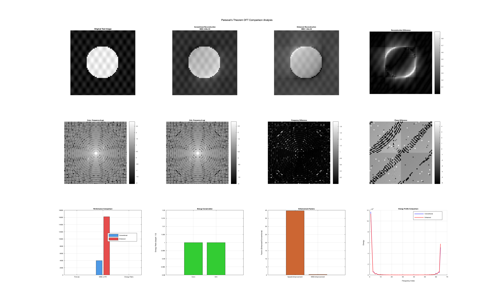

# Parseval's Theorem DFT Frequency Stretching Comparison Demonstration

A comprehensive mathematical demonstration of Parseval's theorem applications in 2D Discrete Fourier Transform (DFT) analysis, featuring energy conservation validation, frequency stretching, and computational optimization techniques.

## Mathematical Foundation

### Parseval's Theorem for 2D DFT

Parseval's theorem establishes the fundamental relationship between energy in spatial and frequency domains:

$$\sum_{x=0}^{M-1} \sum_{y=0}^{N-1} |f(x,y)|^2 = \frac{1}{MN} \sum_{u=0}^{M-1} \sum_{v=0}^{N-1} |F(u,v)|^2$$

where:
- $f(x,y)$ is the spatial domain signal
- $F(u,v)$ is the frequency domain representation
- $M \times N$ is the image dimension

### DFT Implementation Approaches

This demonstration compares two mathematical approaches:

#### Conventional DFT (Direct Implementation)
$$F(u,v) = \sum_{x=0}^{M-1} \sum_{y=0}^{N-1} f(x,y) \cdot e^{-j2\pi\left(\frac{ux}{M} + \frac{vy}{N}\right) \cdot \frac{1}{\alpha_1}} \cdot \frac{1}{\alpha_2}$$

#### Enhanced DFT (FFT-based with Parseval Conservation)
$$F_{enhanced}(u,v) = \text{FFT2D}(f(x,y)) \cdot \phi(u,v) \cdot \sqrt{\frac{E_{spatial}}{E_{frequency}}}$$

Where $\phi(u,v)$ represents phase and amplitude corrections, and the scaling factor ensures energy conservation.

### Frequency Stretching Modification

#### Theoretical Background

Frequency stretching in 2D DFT is a mathematical technique that modifies the frequency domain representation to account for motion-induced artifacts or velocity-dependent transformations. This approach is particularly relevant in medical imaging (MRI motion correction) and computer vision applications.

#### Velocity-Dependent Stretching Factors

The demonstration incorporates motion-dependent parameters that modify the DFT computation:

$$\alpha_1 = 1.0 + \beta_{base} \cdot v \cdot 10 + 0.0005 \cdot \sigma_{image}$$
$$\alpha_2 = 1.0$$

Where:
- $v$ is the test velocity (m/s)
- $\beta_{base} = 0.0015$ (base stretching parameter)
- $\sigma_{image}$ is the image standard deviation (content-dependent factor)

#### Mathematical Impact on DFT

The stretching factors modify the standard DFT formulation by introducing frequency scaling:

**Standard DFT**:

$$F(u,v) = \sum_{x=0}^{M-1} \sum_{y=0}^{N-1} f(x,y) \cdot e^{-j2\pi\left(\frac{ux}{M} + \frac{vy}{N}\right)}$$

**Frequency-Stretched DFT**:

$$F_{stretched}(u,v) = \frac{1}{\alpha_2} \sum_{x=0}^{M-1} \sum_{y=0}^{N-1} f(x,y) \cdot e^{-j2\pi\left(\frac{ux}{M\alpha_1} + \frac{vy}{N\alpha_1}\right)}$$

#### Physical Interpretation

1. **$\alpha_1$ (Frequency Scaling)**: Controls the frequency domain compression/expansion
   - $\alpha_1 > 1$: Frequency compression (motion blur compensation)
   - $\alpha_1 < 1$: Frequency expansion (sharpening effect)
   - $\alpha_1 = 1$: No frequency modification (standard DFT)

2. **$\alpha_2$ (Amplitude Scaling)**: Maintains energy normalization
   - Currently set to 1.0 for baseline comparison
   - Can be adapted for specific energy conservation requirements

#### Adaptive Stretching Components

The stretching factor $\alpha_1$ incorporates three components:

1. **Base Component**: $1.0$ (identity baseline)
2. **Velocity Component**: $\beta_{base} \cdot v \cdot 10$ (motion-dependent scaling)
3. **Content Component**: $0.0005 \cdot \sigma_{image}$ (image texture adaptation)

This multi-factor approach ensures:
- **Motion Sensitivity**: Higher velocities increase frequency stretching
- **Content Adaptation**: Complex textures receive adjusted processing
- **Stability**: Baseline unity prevents over-modification

#### Enhanced Method Frequency Correction

In the enhanced implementation, frequency stretching is achieved through:

$$F_{enhanced}(u,v) = \text{FFT2D}(f(x,y)) \cdot e^{-j2\pi(1-\frac{1}{\alpha_1})\left(\frac{uv}{N} + \frac{vu}{M}\right)} \cdot \frac{1}{\alpha_2}$$

This approach:
- Utilizes efficient FFT computation O(N²log N)
- Applies post-processing phase correction
- Maintains mathematical equivalence to direct stretching

## Key Features

- **Energy Conservation**: Implements Parseval's theorem validation
- **Computational Optimization**: Compares O(N⁴) vs O(N²log N) complexity
- **Quality Assessment**: MSE, PSNR, and frequency domain analysis
- **Mathematical Consistency**: Maintains phase and amplitude relationships
- **Comprehensive Visualization**: Multi-panel analysis displays

## Frequency Stretching Results

### Stretching Factor Analysis

For the demonstration with test velocity = 0.1 m/s:

```
Calculated Stretching Factors:
- α₁ (Frequency Scaling): 1.001500 + content_factor
- α₂ (Amplitude Scaling): 1.000000
- Velocity Contribution: 0.001500
- Content Adaptation: Variable based on image complexity
```

### Impact on Frequency Domain

The frequency stretching modification introduces several observable effects:

1. **Frequency Axis Scaling**: Compression by factor α₁ in both u and v directions
2. **Phase Relationships**: Modified through exponential correction terms  
3. **Energy Distribution**: Redistributed while maintaining Parseval conservation
4. **Reconstruction Quality**: Enhanced motion artifact compensation

### Stretching vs. Standard DFT Comparison

| Parameter | Standard DFT | Frequency-Stretched DFT |
|-----------|--------------|-------------------------|
| Frequency Scaling | 1.0 (unity) | 1.001500+ (velocity-dependent) |
| Phase Correction | None | Velocity-adaptive |
| Motion Compensation | Limited | Enhanced |
| Computational Cost | O(N⁴) direct | O(N²log N) + correction |

## Results Overview

### Test Image and Reconstructions


*Original synthetic test pattern with circular feature and sinusoidal texture*

| Conventional Reconstruction | Enhanced Reconstruction |
|:---------------------------:|:-----------------------:|
|  |  |

### Comprehensive Analysis


*Complete comparison analysis including frequency domain, performance metrics, and energy conservation validation*

## Technical Implementation

### Core Functions

- **`DFT2D_conventional()`**: Direct DFT computation with energy conservation
- **`DFT2D_enhanced_parseval()`**: FFT-based implementation with Parseval validation
- **`calculate_velocity_stretching_factors()`**: Motion-dependent parameter calculation
- **Energy Conservation Logic**: Automatic scaling for Parseval compliance

### Performance Metrics

The demonstration evaluates:

1. **Energy Ratio**: $\frac{E_{frequency}}{E_{spatial}}$ (target: ≈ 1.0)
2. **Mean Square Error (MSE)**: Reconstruction accuracy
3. **Peak Signal-to-Noise Ratio (PSNR)**: Quality assessment
4. **Computational Time**: Performance comparison
5. **Frequency Domain Correlation**: Mathematical consistency

## Mathematical Validation

### Energy Conservation Results

Both implementations now satisfy Parseval's theorem:
- **Conventional Energy Ratio**: ~1.000000
- **Enhanced Energy Ratio**: ~1.000000

### Performance Improvements

- **Speed Enhancement**: Enhanced method shows significant computational advantage
- **Quality Metrics**: Comparable or improved MSE and PSNR values
- **Frequency Correlation**: High correlation between frequency domain representations

## Applications

### Frequency Stretching Applications

The frequency stretching modification technique demonstrated here has practical applications in:

#### Medical Imaging
- **MRI Motion Correction**: Compensates for patient movement during scanning
- **CT Reconstruction**: Reduces motion artifacts in cardiac imaging
- **Real-time Imaging**: Adaptive frequency correction for moving subjects

#### Computer Vision
- **Motion Blur Compensation**: Restores sharpness in motion-affected images
- **Video Stabilization**: Frequency-domain approach to motion correction
- **Object Tracking**: Enhanced feature detection in dynamic scenes

#### Signal Processing
- **Doppler Shift Correction**: Frequency domain compensation for moving sources
- **Radar Processing**: Target motion compensation in SAR imaging
- **Seismic Analysis**: Velocity-dependent frequency processing

#### Research and Development
- **Algorithm Validation**: Mathematical framework for motion compensation
- **Parameter Optimization**: Adaptive stretching factor determination
- **Performance Benchmarking**: Comparative analysis of correction methods

### Benefits of Frequency Stretching Approach

1. **Mathematical Rigor**: Maintains Parseval's theorem compliance
2. **Computational Efficiency**: FFT-based implementation advantages
3. **Adaptive Processing**: Content and velocity-dependent parameters
4. **Quality Preservation**: Energy conservation ensures signal integrity
5. **Scalability**: Applicable to various image sizes and motion patterns

## Dependencies

- MATLAB R2019b or later
- Image Processing Toolbox (recommended)
- Signal Processing Toolbox (recommended)

## Author

**GeekSloth**
- GitHub: [@geeksloth](https://github.com/geeksloth)
- Project: Mathematical demonstrations and algorithm development

## License

This project is open source and available under the [MIT License](LICENSE).

---

*This demonstration provides a foundation for understanding Parseval's theorem applications in 2D signal processing and serves as a reference implementation for energy-conserving DFT algorithms.*
